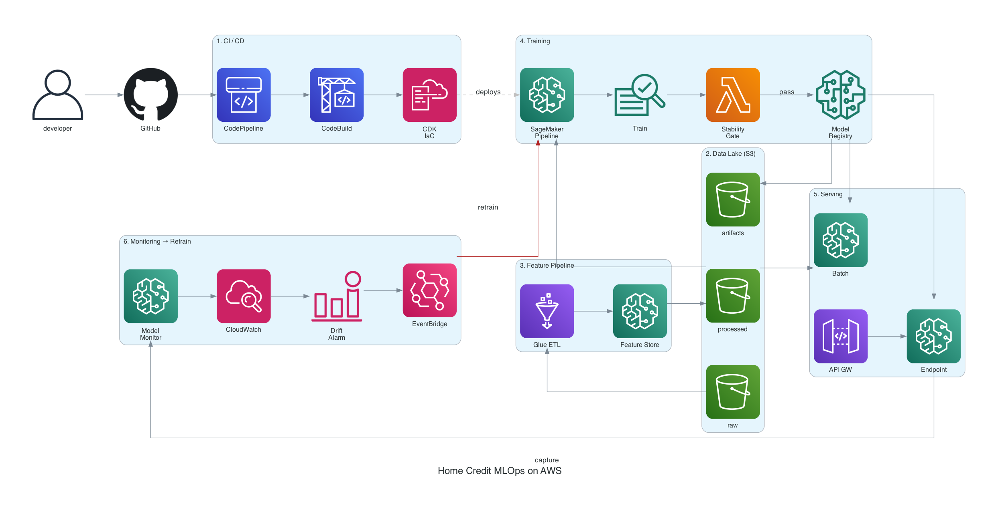
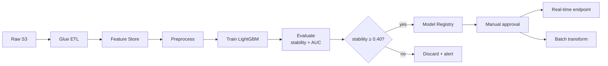
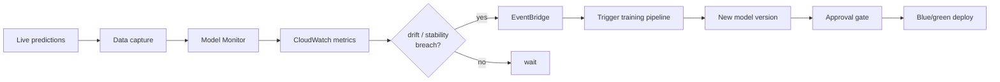

# Home Credit MLOps on AWS

End-to-end MLOps pipeline for the [Home Credit Credit Risk Model Stability](https://www.kaggle.com/competitions/home-credit-credit-risk-model-stability/) Kaggle competition — a realistic credit-risk problem scored on **stability over time**, not just AUC.

> Built to exercise every major MLOps pillar: data, features, training, registry, CI/CD, serving, monitoring, drift→retrain, explainability, governance, cost.

## Architecture



<details>
<summary>Training pipeline flow</summary>


</details>

<details>
<summary>Drift → Retrain loop</summary>


</details>

## Repository layout

```
homecredit-aws-mlops/
├── infra/              # CDK stacks (S3, IAM, SageMaker domain, pipelines)
├── src/
│   ├── features/       # Feature engineering (Polars → Glue)
│   ├── training/       # LightGBM baseline + custom trainers
│   ├── pipelines/      # SageMaker Pipeline definitions + evaluate step
│   └── inference/      # Endpoint handlers
├── docs/               # Architecture diagrams (Python → Graphviz)
├── notebooks/          # EDA, local baseline
├── tests/              # Unit tests (pytest)
├── scripts/            # Deploy / data-download helpers
└── .github/workflows/  # CI (uv + ruff + pytest + cdk synth)
```

## Roadmap — 7 phases, one MLOps muscle each

| Phase | Scope | MLOps concept |
|---|---|---|
| 1 | CDK base stack (S3 × 3, IAM, budget), LightGBM notebook baseline | Reproducible infra |
| 2 | Glue / SM Processing → **Feature Store** (online + offline) | Training/serving parity, PIT joins |
| 3 | SageMaker Pipeline: preprocess → train → evaluate → conditional register | DAGs, HPO, gating |
| 4 | Real-time endpoint + batch transform, API Gateway, autoscaling | Two serving modes, blue/green |
| 5 | Model Monitor + CloudWatch + EventBridge → auto-retrain | Closed-loop drift response |
| 6 | Clarify bias, Model Cards, lineage via CloudTrail | Responsible AI, audit |
| 7 | Spot training, endpoint autoscale-to-zero, cost dashboards | FinOps |

## Quickstart

Prereqs: [uv](https://docs.astral.sh/uv/), `brew install libomp graphviz`, `npm install -g aws-cdk`.

```bash
# 1. Install Python deps (creates .venv, writes uv.lock)
uv sync --extra dev

# 2. Load project-local AWS context (isolated homecredit IAM user, us-west-2)
source env.sh

# 3. Bootstrap CDK (first time only per account/region)
uv run cdk bootstrap aws://$CDK_DEFAULT_ACCOUNT/us-west-2

# 4. Deploy Phase 1 stack
./scripts/deploy_infra.sh

# 5. Stream Kaggle data directly into the S3 raw bucket (zero local disk)
uv run python scripts/download_to_s3.py
```

Everything runs inside the `uv`-managed venv via `uv run <cmd>` — no manual activation.

## Architecture isolation

This project runs under a **dedicated IAM user** (`homecredit-dev`) in `us-west-2`, with project-local `~/.aws/credentials` loaded only when `env.sh` is sourced. All resources carry `Project=HomeCredit` and `ManagedBy=<user>` tags activated as Cost Allocation Tags, so spend is cleanly attributable.

## Regenerate diagrams

```bash
uv run python docs/architecture.py   # writes architecture.png + architecture.svg
```

## Links

- [Kaggle competition](https://www.kaggle.com/competitions/home-credit-credit-risk-model-stability/)
- GitHub: [yybrother989/homecredit-aws-mlops](https://github.com/yybrother989/homecredit-aws-mlops)
