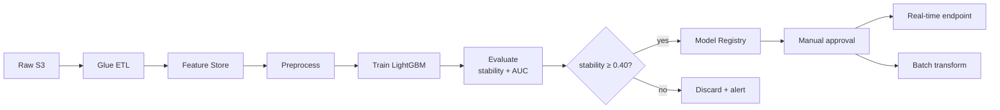
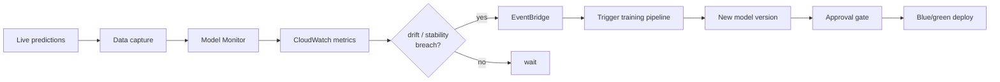

# Home Credit MLOps on AWS

End-to-end MLOps pipeline for the [Home Credit Credit Risk Model Stability](https://www.kaggle.com/competitions/home-credit-credit-risk-model-stability/) Kaggle competition — a realistic credit-risk problem scored on **stability over time**, not just AUC.

> Built to exercise every major MLOps pillar: data, features, training, registry, CI/CD, serving, monitoring, drift→retrain, explainability, governance, cost.

## Architecture


<details>
<summary>Training pipeline flow</summary>


</details>

<details>
<summary>Drift → Retrain loop</summary>


</details>

## Repository layout

```
homecredit-aws-mlops/
├── infra/              # CDK stacks (S3, IAM, SageMaker domain, pipelines)
├── src/
│   ├── features/       # Feature engineering (Polars → Glue)
│   ├── training/       # LightGBM baseline + custom trainers
│   ├── pipelines/      # SageMaker Pipeline definitions + evaluate step
│   └── inference/      # Endpoint handlers
├── docs/               # Architecture diagrams (Python → Graphviz)
├── notebooks/          # EDA, local baseline
├── tests/              # Unit tests (pytest)
├── scripts/            # Deploy / data-download helpers
└── .github/workflows/  # CI (uv + ruff + pytest + cdk synth)
```

## Roadmap — 7 phases, one MLOps muscle each

| Phase | Scope | MLOps concept | Result |
|---|---|---|---|
| 1 ✅ | CDK base stack (S3 × 3, IAM, budget), local LightGBM baseline on depth-0 tables (224 features) | Reproducible infra | val AUC **0.823**, stability **0.620** |
| 2 ✅ | Glue PySpark ETL over all 30+ raw tables (975 features incl. PIT-filtered depth-1/2 aggregations), Athena external table, Feature Group contract for Phase 4 | PIT correctness, wide feature catalog | val AUC **0.819**, stability **0.612** (⚠ wider feature set overfits — HPO is Phase 3's job) |
| 3 🟡 | SageMaker Pipeline: PullFeatures → HPO TuningStep → Evaluate → ConditionStep → RegisterModel. CDK stack `HomeCreditTrainingStack` + pipeline upserted in account | DAGs, HPO, gating | Blocked on AWS account service quotas (`ml.m5.xlarge processing job usage = 0`) — pending quota-increase request or switch to t3.xlarge (default quota 2) |
| 4 | Batch Transform only (user opted out of real-time endpoint for cost), Model Package Group → ScheduledEventBridge → Lambda → StartTransformJob | Batch serving, Model Registry workflow | |
| 5 | Model Monitor + CloudWatch + EventBridge → auto-retrain | Closed-loop drift response | |
| 6 | Clarify bias, Model Cards, lineage via CloudTrail | Responsible AI, audit | |
| 7 | Spot training, CloudWatch dashboards, nightly cleanup | FinOps | |

## Quickstart

Prereqs: [uv](https://docs.astral.sh/uv/), `brew install libomp graphviz`, `npm install -g aws-cdk`.

```bash
# 1. Install Python deps (creates .venv, writes uv.lock)
uv sync --extra dev

# 2. Load project-local AWS context (isolated homecredit IAM user, us-west-2)
source env.sh

# 3. Bootstrap CDK (first time only per account/region)
uv run cdk bootstrap aws://$CDK_DEFAULT_ACCOUNT/us-west-2

# 4. Deploy all stacks (Phase 1 base + Phase 2 feature)
./scripts/deploy_infra.sh

# 5. Stream Kaggle data directly into the S3 raw bucket (zero local disk)
uv run python scripts/download_to_s3.py

# 6. (Phase 2) Unzip locally once + mirror to S3 so Glue can read parquets
aws s3 cp s3://homecredit-raw-$CDK_DEFAULT_ACCOUNT-usw2/homecredit.zip data/raw/
unzip -q data/raw/homecredit.zip -d data/raw/
./scripts/sync_raw_to_s3.sh

# 7. (Phase 2) Kick off the Glue feature-engineering job (~20 min, ~$1)
aws glue start-job-run --job-name homecredit-features --query JobRunId --output text

# 8. (Phase 2) Ingest wide features into SageMaker Feature Store (offline)
uv run python src/features/ingest_to_feature_store.py

# 9. (Phase 2) Retrain LightGBM straight from the Feature Store
uv run python src/training/train_lightgbm.py --feature-source athena

# 10. (Phase 3) Upsert + start HPO pipeline (requires ml.m5.xlarge quota — see below)
uv run python scripts/run_training_pipeline.py --max-jobs 5 --upsert --start
```

Everything runs inside the `uv`-managed venv via `uv run <cmd>` — no manual activation.

## Architecture isolation

This project runs under a **dedicated IAM user** (`homecredit-dev`) in `us-west-2`, with project-local `~/.aws/credentials` loaded only when `env.sh` is sourced. All resources carry `Project=HomeCredit` and `ManagedBy=<user>` tags activated as Cost Allocation Tags, so spend is cleanly attributable.

## Regenerate diagrams

```bash
uv run python docs/architecture.py   # writes architecture.png + architecture.svg
```

## Notes on Phase 3 — HPO pipeline

`HomeCreditTrainingPipeline` is a 4-step SageMaker Pipeline defined in
[`src/pipelines/training_pipeline.py`](src/pipelines/training_pipeline.py):

1. **PullFeatures** — `ScriptProcessor` runs `pull_features.py`, queries
   `homecredit_ml.features` via Athena CTAS, writes time-split train/val parquet.
2. **HPOTuning** — `TuningStep` running SageMaker Automatic Model Tuning,
   Bayesian search over `num-leaves`, `learning-rate`, `feature-fraction`,
   `bagging-fraction`. Objective = maximize weekly-stability metric parsed
   from training-job log regex.
3. **EvaluateBestModel** — pulls the best trial artifact, runs `evaluate.py`
   for the full AUC + stability report, writes `evaluation.json`.
4. **StabilityGate** (`ConditionStep`) — if `stability ≥ 0.55`, register the
   model to `HomeCreditModels` package group as `PendingManualApproval`.

**Known blockers (chasing them in order):**

1. **AWS account service quotas** — fresh accounts ship with
   `ml.m5.xlarge processing/training job usage = 0`. Only `ml.t3.{medium,
   large,xlarge}` have nonzero defaults. Pipeline currently pinned to t3.xlarge
   (sufficient for 975-feature LightGBM, slower per trial). Production fix:
   AWS Service Quotas request for `ml.m5.xlarge` (1–3 days turnaround).
2. **Container dependency hell** — the SageMaker `sklearn 1.2-1` base image
   ships Python 3.9 + numpy 1.24 + pandas 1.1 + scipy 1.8, all binary-
   compatible with each other. Layering modern `awswrangler` / `pyarrow`
   via `requirements.txt` forces a partial upgrade that breaks numpy ABI on
   pyarrow's Table → pandas conversion (`numpy.core.multiarray failed to
   import`). Tried `--force-reinstall` of the whole numpy/pandas/pyarrow
   group — got further (Athena CTAS query succeeded, output parquet read)
   but hit a `MultiIndex` deserialization failure during column metadata
   reconstruction at 975-column scale. Production fix: custom Docker image
   in ECR with the data stack baked in, plus `--datalake-formats iceberg`
   for write parity. Tracked as Phase 7 FinOps "BYO container" task.

Until those are unblocked, Phase 3 is **code-complete + CDK-deployed**:
`HomeCreditTrainingStack` is live, `HomeCreditModels` package group exists,
`HomeCreditTrainingPipeline` is upserted and visible in SageMaker Studio,
and any pipeline execution gets as far as the PullFeatures step before the
container env mismatch trips it.

## Notes on Feature Store usage

Phase 2 registers the Glue wide-feature output as an **Athena external table**
(`homecredit_ml.features`, 975 columns × 1.5M rows) rather than populating the
SageMaker Feature Group via `PutRecord`. The Feature Group itself is CDK-
provisioned as a **schema contract** — we pin the Phase 4 real-time ingestion
mechanism to it when online serving comes online.

This is a deliberate trade-off: `FeatureGroup.ingest()` is designed for
streaming writes (tens of records/sec), and pushing 1.5M rows through it is
prohibitively slow (we measured 22 GB memory footprint with no meaningful
progress after 15 min). Direct S3 → Athena is 14 s end-to-end for the same
table, which matches how production ML teams materialize offline features.

## Links

- [Kaggle competition](https://www.kaggle.com/competitions/home-credit-credit-risk-model-stability/)
- GitHub: [yybrother989/homecredit-aws-mlops](https://github.com/yybrother989/homecredit-aws-mlops)
